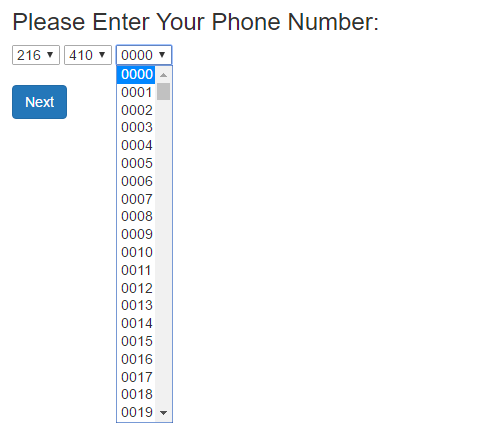

## Guidelines, Principles and Theories*
  

* The slide content is based heavily on Chapter 2 of Shneiderman's and Plaisant's textbook, Designing the User Interface: Strategies for Effective Human-Computer Interaction, 5th edition.

### Guidelines, principles, and theories aim to guide the design process and prevent the frustration caused by design problems

### Guidelines 
- Tend to be specific, build on abstract design principles, and describe best practices
- Typically proposed by the owner and derived by practical experience or empirical studies
- They promote consistency in terminology, language, appearance, etc.

### Guidelines
  - Examples:
    - [Material design guidelines](https://material.io)
    - [iOS Human Interface Guidelines](https://developer.apple.com/ios/human-interface-guidelines/overview/design-principles)
    - [watchOS Human Interface Guidelines](https://developer.apple.com/watchos/human-interface-guidelines/overview/)

### Guidelines
#### are debatable and can be controversial!

### Guidelines
  - Proponents...
    - Better than nothing
    - Establishing a shared language that leads into a consistent terminology usage between designers
    - A record for best practices derived from practical experience
    - Live document contributed by the design community
    - Accelerate the improvement

### Guidelines
  - Opponents...
    - Too specific
    - Incomplete
    - Not always applicable
    - Hard to manage to ensure enforcement, exemption, or enhancement
    - Sometimes not updated or even wrong

### Let's look into examples of guidelines

### Guidelines for Navigating the Interface

- National Cancer Institute (NCI) has published a 388-guideline
set for Web pages:

  - Standardize task sequences
  - Ensure that embedded links are descriptive
  - Use unique and descriptive headings
  - Use check boxes for binary choices
  - Develop pages that will print properly
  - Use thumbnail images to preview larger images

## Guidelines for Accessibility
- The World Wide Web Consortium (W3C) accessibility Guidelines
  - Text alternatives
  - Time-based media (e.g., movies, or animations)
  - Distinguishable content
  - Predictable web content

## Guidelines for organizing the display
- High-level goals for display organization by Smith and Mosier (1986)
  - Consistency of data display
  - Efficient information assimilation by the user
  - Minimal memory load on the user
  - Compatibility of data display with data entry
  - Flexibility for user control of data display

## Guidelines may be application, platform, or use case specific

## Some of these guidelines have been around for decades and are still valid today!

## Example: Lockheed's display guidelines (1981)
  - Be consistent in labelling and graphic conventions
  - Standardize abbreviations
  - Use consistent formatting in all displayers
  - Present data only if they assist the operator
  - Present information graphically where appropriate 
  - Present digital values only when necessary and useful

## Guidelines for Getting the User's attention (Notification)
- Users can be overwhelmed by the amount of information presented to them
- Wickens and Hollands (2000) provided guidelines for getting the user's attention

  
  |         |            |   |
  | ------------- |:-------------:| -----:|
  | Intensity     | Marking | Size |
  | Choice of fonts      | Inverse coloring      |   Blinking |
  | Color |        Audio feedback |

## But Notifications can be missed, or overwhelming!!

## Guidelines for Facilitating Data Entry
- Smith and Mosier (1986) guidelines for data entry
  - Consistency of data-entry transactions
  - Minimal input actions by the user
  - Minimal memory load on users
  - Compatibility of data entry with data display
  - Flexibility for user control of data entry

### Principles
- They tend to be more general, fundamental, and applicable to a wide range of technologies
- Middle-level principles (not too specific or abstract)
- Address individual differences in users
- Provide a better way of understanding design in a more broad sense
- They tend to require clarification or interpretation
- Summarized in the form of heuristics or golden rules

### Principles
- Examples:
  - The principle of recognizing user diversity
  - [Jakob Nielsen's ten usability heuristics for user interface design](https://www.nngroup.com/articles/ten-usability-heuristics/)
  - [Ben Shneiderman's eight golden rules of interface design](https://www.cs.umd.edu/users/ben/goldenrules.html)
  - [Don Norman's Design Principles](http://www.jnd.org/dn.mss/affordance_conv.html)

## Principles

> No design is ideal for all users and situations, so as a designer you must strive for an accurate understanding of your users and the context in which they use your product

### Principles: Determine users' skill levels (User Profile)
- Difficult and underestimated
- Understanding your users must be
  - Age, gender, physical, cognitive, education, cultural, skills, experience
- Assumptions about the diverse community of users.
  - Doctors, librarians, engineers, college students
- Assumptions about users from different part of the world
- Skills, limited education, low tech skills

## This sounds complicated! How do I know my users?

## One way is to split our user base
- Novice or first-time users
- Knowledgeable intermittent users
- Expert or frequent users

## Principles: Identify the tasks
- Identify the set of tasks to be carried out
- Task analysis
  - Long hours of observing and interviewing users
  - High-level actions => middle-level actions => atomic actions
- Frequency of use
  - frequent vs infrequent tasks

## Principles: Choose an Interaction Style
- Direct manipulation
- Menu selection
- Form fill-in
- Command language
- Natural language
- Blending several interaction styles

## 1- Direct manipulation

- Create a visual representation of the actions/objects
- Facilitate learning and retention
- Users can explore and carry out tasks rapidly
- Requires design skills and maybe hard to program
- Example:
  - Dragging and dropping a file icon into a trash can icon.

## 2- Menu Selection
- Users read list of items, select most appropriate for their
task, observe the effect
- Ideal for novice, intermittent users, and frequent users if the display and selection mechanism is rapid
- Requires careful thinking and task analysis

## 2- Menu Selection (cont.)
- Pros:
  - Shortens learning and reduces keystrokes
  - Structures decision making
  - Permits use of dialog-management tools
  - Easy support for error handling
- Cons:
  - May result in complex many menus
  - May slow frequent users
  - Consumes screen space
  - Requires rapid display rate

## 3- Form fill-in 
- Users need to fill in data into form fields
- Field labels should be clear
- They permit the use of form management-tools
- Users should be capable of responding to error messages

## 3- Form fill-in (cont.)
- Avoid the use of inappropriate form controls
 <a href="http://imgur.com/Jfv6F2r" target="blank">source</a>

## 4- Command language
- For frequent users, provides a strong feeling of being in control
- Requires training and appeals to "power" users
- Directed towards users who are comfortable with handling complex syntax
- Supports user initiative
- Allows convenient creation of user-defined macros

## 4- Command language (cont.)
- Poor error handling
  - Error rates can be high and hard to provide

## 5- Natural language
- Relieves burden of learning syntax
- Unpredictable but getting better and improved
- Lack of context of requesting the next command
- May be useful at certain times

## Principles: The Eight Golden Rules of Interface Design
- 1) Strive for consistency
  - Use identical terminology, consistent color, layout etc.
- 2) Seek universal usability
  - Consider novice to expert differences and features
- 3) Offer informative feedback
  - For every action, there should be system feedback

## Principles: The Eight Golden Rules of Interface Design (cont.)
- 4) Design dialogs to yield closure 
 - Organize sequence of actions into groups with beginning, middle, and end
- 5) Prevent errors
 - Design a system that does not allow users to make serious errors (e.g., gray out inappropriate elements)

## Principles: The Eight Golden Rules of Interface Design (cont.)
- 6) Permit easy reversal of actions
  - Relieve anxiety and encourage exploration
- 7) Keep users in control
  - Give experienced users the control of the interface
- 8) Reduce short-term memory load
  - Do not require re-entry of available information

## Principles: Prevent errors
- Make error messages specific, positive in tone, and constructive
- Correct actions
  - Gray out inappropriate actions
  - Selection rather than freestyle typing
  - Automatic completion
- Complete sequences
  - Single abstract commands
  - Macros and subroutines

## Automation and Human Control

> Automation is useful and increasingly popular for many tasks, but preserving human control is still an important goal

## Theories
- High-level theories and models that describe objects and actions with consistent terminology or make predictions regarding reading, typing, or pointing times
- The goal is to support communication between experts   

## Theories (cont.)
[The additional slides are adapted from the slides of the textbook and are available on Blackboard](http://sso.kau.edu.sa)

## References
- Shneiderman, B. and Plaisant, C., Designing the User Interface: Strategies for Effective Human-Computer Interaction: 5th Edition
- Alan Dix, Human Computer Interaction, 3rd Edition
